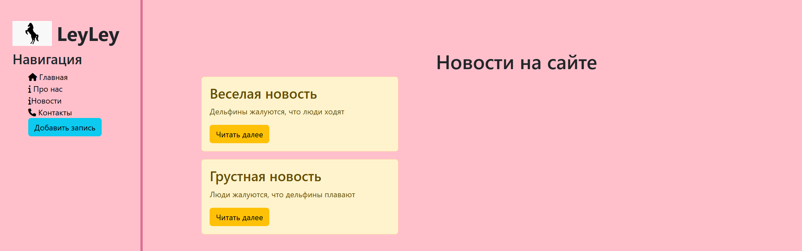
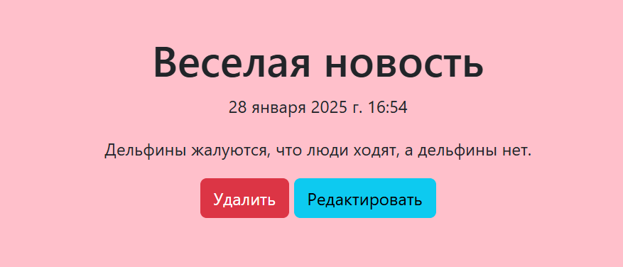
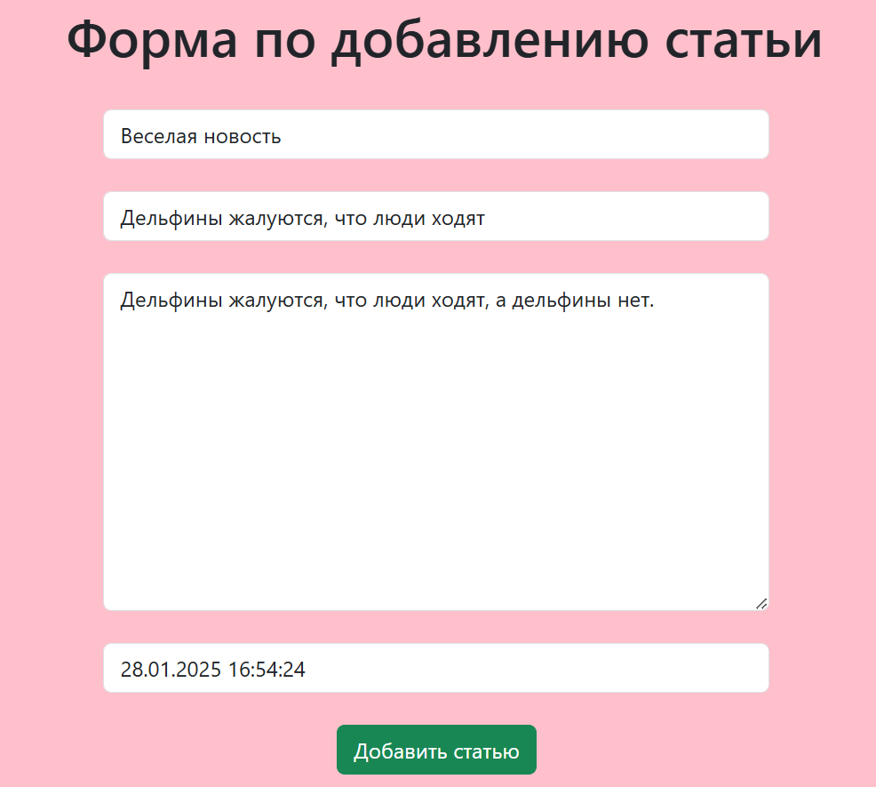
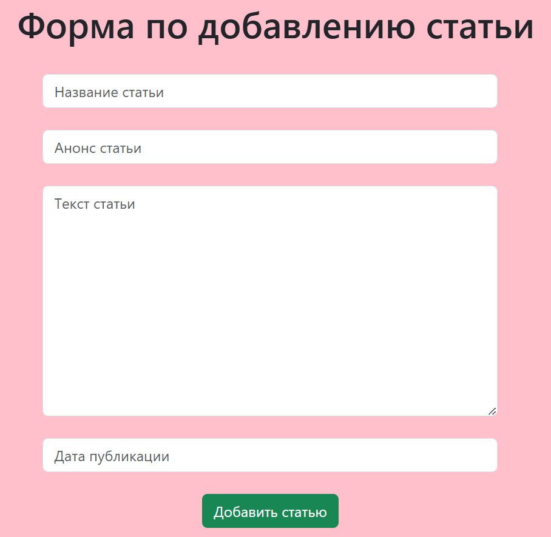

# Тестовое задание на позицию Junior Python developer

CRUD-проект с использованием фреймворка django по курсу itproger. Представляет собой сервис для добавления статей на сайт.

## Требования

Python 3.9

## Установка

1. Клонируйте репозиторий:

`git clone https://github.com/Leila132/Django-itProger-.git`

2. Перейдите в директорию проекта:

`cd Django-itProger-`

3. Установите зависимости:

`pip install -r requirements.txt`

## Запуск

Чтобы запустить проект, выполните:

`python manage.py runserver`

## Использование

На вкладке "Новости" можно увидеть уже опубликованные ранее новости.

Нажав на "Читать далее" можно подробнее прочитать новость и либо изменить ее, либо удалить.

При переходе на "Редактировать" новость полностью отображается в полях ввода, где можно изменить составляющие.

При переходе на "Удалить" можно перейти на страницу, где есть кнопка, позволяющая удалить данную статью.

На боковой панели есть кнопка "Добавить запись", которая открывает форму для добавления новой статьи.

